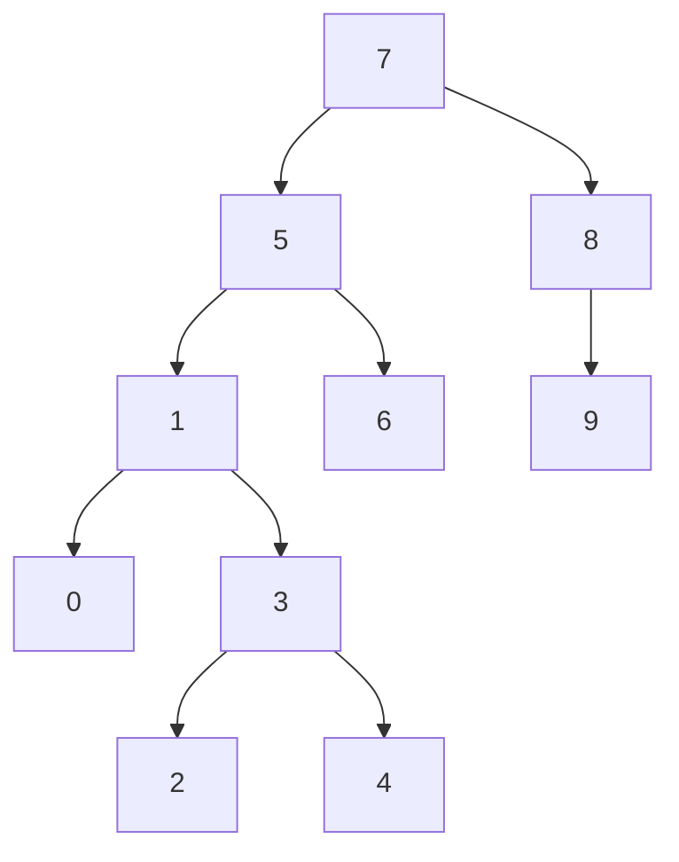

# Veri Yapıları ve Algoritmalar > Binary Search Tree Projesi

## Proje 3
[7, 5, 1, 8, 3, 6, 0, 9, 4, 2] dizisinin Binary-Search-Tree aşamalarını yazınız.

### Aşamalar :
 İlk sayı 7, root olarak seçilir
 
 Solunda 5, sağında 8 bulunur
 
 8 değerinin sağında 9 bulunur

 5 değerinin solunda 1, sağında 6 bulunur

 1 değerinin solunda 0, sağında 3 bulunur
 
 3 değerinin solunda 2, sağında 4 bulunur
